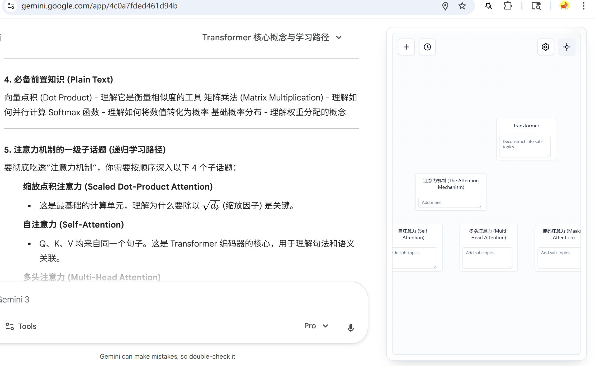

# Recursive-Learn

> 🌳 将你与 AI 的学习对话可视化为结构化的知识树。

[English](README.md) | [中文](README_CN.md)

**Recursive-Learn** 是一个 Chrome 扩展程序，它可以将你与 AI（ChatGPT, Claude, Gemini）的线性对话转化为结构化的知识树。它能帮助你保持专注，可视化你的学习进度，并且所有数据都存储在本地。



## 📦 安装（用户指南）

你可以直接使用此扩展程序，无需安装 Node.js 或运行任何构建命令。

1.  **下载代码**
    *   点击上方绿色的 **Code** 按钮，选择 **Download ZIP**。
    *   将 ZIP 文件解压到你电脑上的一个文件夹中。

2.  **加载到 Chrome**
    *   打开 Chrome 并访问 `chrome://extensions/`（或者点击工具栏上的拼图图标 -> 管理扩展程序）。
    *   在右上角开启 **开发者模式 (Developer mode)**。
    *   点击左上角的 **加载已解压的扩展程序 (Load unpacked)**。
    *   选择你刚才解压代码的文件夹。

3.  **开始学习**
    *   **提示**: 点击 Chrome 工具栏中的拼图图标，将 Recursive-Learn **固定 (Pin)** 到工具栏。点击扩展图标可以切换侧边栏的显示/隐藏。
    *   访问 [ChatGPT](https://chatgpt.com), [Claude](https://claude.ai), 或 [Gemini](https://gemini.google.com)。
    *   Recursive-Learn 侧边栏将会出现在右侧。
    *   输入一个主题（例如 "React Hooks"）并点击 "Start Learning"。

## 🔄 更新

当有新版本可用时（你可能会在扩展中看到横幅提示），请导航到你解压代码的文件夹并运行更新脚本：

*   **Windows**: 双击 `update.bat`
*   **Mac/Linux**: 在终端中运行 `./update.sh`

然后前往 `chrome://extensions/` 并在 Recursive-Learn 卡片上点击 **刷新 (Refresh)** 图标。

## 🛠️ 开发（开发者指南）

如果你想修改代码或样式：

1.  **安装依赖**
    ```bash
    npm install
    ```

2.  **构建 CSS**
    本项目使用 Tailwind CSS。CSS 文件 (`src/content/content.css`) 已包含在仓库中，但如果你修改了 `src/content/tailwind.css`，你需要重新构建它：

    *   **一次性构建:**
        ```bash
        npm run build:css
        ```
    *   **监听模式 (改动时自动重构):**
        ```bash
        npm run watch:css
        ```

3.  **重新加载扩展**
    修改 JS 或 CSS 文件后，回到 `chrome://extensions/` 并在 Recursive-Learn 卡片上点击 **刷新** (圆形箭头) 图标。

## 🔒 数据与隐私

*   **本地存储**: 你所有的学习树和数据都存储在浏览器的本地存储中 (`chrome.storage.local`)。
*   **无云端同步**: 除了你正在对话的 AI 平台外，没有数据会被发送到任何外部服务器。
*   **安全**: 删除扩展程序将会移除你的本地数据。

## 📄 文档

*   查看 [第 3 步](#3-开始学习) 获取快速使用说明。
